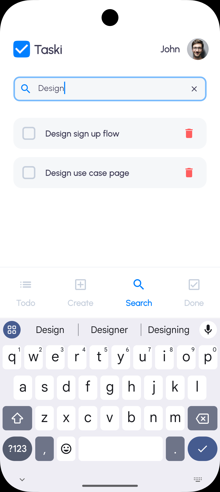

<h1 align="center">
    
    <br>
    Taski
</h1>

<h4 align="center">
    Projeto desenvolvido em Flutter utilizando a linguagem Dart, consiste em um aplicativo de gerenciamento de tarefas através de notas. Foi desenvolvido para <a href="https://github.com/WL-Consultings/challenges/tree/main/mobile"
    itemprop="url">o desafio de código mobile</a>.
</h4>

<p align="center">

  

  

  

  

</p>

<p align="center">
  <a href="#rocket-tecnologias">Tecnologias</a>&nbsp;&nbsp;&nbsp;|&nbsp;&nbsp;&nbsp;
  <a href="#information_source-como-executar">Como Executar</a>&nbsp;&nbsp;&nbsp;|&nbsp;&nbsp;&nbsp;
  <a href="#information_source-estrutura-do-projeto">Estrutura do Projeto</a>&nbsp;&nbsp;&nbsp;|&nbsp;&nbsp;&nbsp;
  <a href="#information_source-melhorias-futuras">Melhorias Futuras</a>&nbsp;&nbsp;&nbsp;|&nbsp;&nbsp;&nbsp;
  <a href="#memo-licença">Licença</a>&nbsp;&nbsp;&nbsp;|&nbsp;&nbsp;&nbsp;
  <a href="#octocat-autor">Autor</a>
</p>


<p align="center">
  
  
  
  
</p>

<p align="center">
  
  
  
</p>


## :rocket: Tecnologias

-  [Flutter](https://flutter.dev/)
-  [Dart](https://dart.dev/)
-  [GetIt](https://pub.dev/packages/get_it)
-  [Hive](https://pub.dev/packages/hive)
-  [VS Code][vc]

## :information_source: Como Executar

Para executar essa aplicação você pode [baixar o apk aqui](https://github.com/JonsCarvalho/taski/releases/download/v1.0.0/app-release.apk). Para instalar em seu dispositivo android, basta habilitar fontes desconhecidas. Ou se preferir pode instalar em um emulador android como o [Bluestacks](https://www.bluestacks.com/pt-br/index.html).

Ou

Para clonar e executar essa aplicação, você irá precisar do [Git](https://git-scm.com) + [Flutter](https://flutter.dev/) + [VS Code][vc] instalados no seu computador. Na sua linha de comando:


```bash
# Clone esse repositório
$ git clone <https://github.com/JonsCarvalho/taski>

# Vá para o repositório
$ cd taski

# Abra no VS Code
$ code .

# Execute
$ flutter run # ou tecle F5


```

## :information_source: Estrutura do Projeto

- Arquitetura

A arquitetura adotada para esse projeto é baseada em Clean Architecture, que segue o princípio da separação de responsabilidades e promove um código mais modular e testável. A estrutura é organizada em camadas bem definidas:

Camada de Domínio (Domain Layer): Contém as entidades principais e a lógica de negócios do aplicativo. Aqui, definimos as regras de negócio que são independentes de qualquer framework ou biblioteca.

Camada de Apresentação (Presentation Layer): Contém a lógica relacionada à interface do usuário, como controllers, widgets, e views. Aqui é onde a interação com o usuário ocorre e a comunicação com a camada de domínio é realizada.

Camada de Dados (Data Layer): Responsável por acessar fontes de dados externas, como APIs, bancos de dados locais (Hive, por exemplo), etc. Essa camada implementa os repositórios definidos na camada de domínio, e é onde a persistência de dados ocorre.

Camada de Dependência (Dependency Injection): Utilizamos o GetIt para gerenciar e injetar as dependências no aplicativo, garantindo um gerenciamento de dependências eficiente e facilitando a manutenção e testes.

- Gerência de Estados

Optamos por gerenciar o estado utilizando o ChangeNotifier, que permite uma comunicação eficiente entre a camada de apresentação e a camada de dados. O ChangeNotifier é utilizado para notificar os listeners sobre mudanças no estado, como ao buscar tarefas ou atualizar o status de uma tarefa.

- Design Patterns Utilizados

Singleton: Para garantir uma única instância de certas classes como o controlador de estado (HomeController), utilizamos o padrão Singleton, que é gerenciado pelo GetIt.

Factory: O padrão Factory é utilizado para criar objetos de forma flexível sem expor a lógica de construção ao usuário, como no caso de converter entre entidades e DTOs (Data Transfer Objects).

Repository: Implementamos o padrão Repository para abstrair o acesso a dados e permitir que a camada de apresentação interaja com a camada de dados de forma independente de como os dados são armazenados (por exemplo, Hive ou uma API).

- Utilização de Packages

Packages que foram utilizados: 

[hive](https://pub.dev/packages/hive) Para banco de dados local (persistência de dados). Ele oferece uma solução simples e eficiente para armazenar dados no dispositivo.
[get_it](https://pub.dev/packages/get_it) Para injeção de dependências. Facilita o gerenciamento de instâncias únicas e a organização do código.
[mockito](https://pub.dev/packages/mockito) Para mockar dependências durante os testes unitários, garantindo que possamos testar o comportamento das classes isoladas sem a necessidade de depender de serviços externos.

- Estrutura de Pastas

A estrutura de pastas do projeto segue as convenções do Clean Architecture, organizando o código em camadas. Aqui está um exemplo da estrutura de diretórios:

```
lib/
│
├── core/
│   ├── constants/      # Constantes globais do projeto
│   ├── shared/         # Componentes reutilizáveis (widgets, utils, etc.)
│      └── ui/          # Componentes de UI base (ex: BasePage)
│
├── features/
│   ├── create/         # Funcionalidades e UI relacionadas à criação de tarefas
│   ├── done/           # Funcionalidades e UI relacionadas à página de tarefas concluídas
│   ├── home/           # Funcionalidades e UI relacionadas à página inicial
│   ├── search/         # Funcionalidades e UI relacionadas à página de busca de tarefas
│   └── task/           # Funcionalidades e UI relacionadas às tarefas
│
└── main.dart           # Ponto de entrada do aplicativo
```


## :information_source: Melhorias Futuras

Embora o aplicativo já esteja funcional, há várias melhorias que podem ser implementadas para otimizar a experiência do usuário, melhorar o desempenho e garantir uma maior robustez do código. Aqui estão algumas melhorias que podem ser exploradas no futuro:

1. Paginação de Dados

Atualmente, os dados das tarefas são carregados todos de uma vez, o que pode causar travamentos ou lentidão quando há uma grande quantidade de tarefas armazenadas. Para otimizar o desempenho, especialmente quando o número de tarefas cresce significativamente, podemos implementar paginação. Com isso, as tarefas seriam carregadas em "páginas" menores, diminuindo o impacto na renderização e proporcionando uma experiência mais fluida ao usuário.

Como Implementar:

Utilizar o ScrollController para detectar quando o usuário chega ao final da lista de tarefas e então carregar mais dados.
Implementar limites de carregamento por vez, como 20 ou 50 itens por página.

2. Validação de Campos ao Criar Tarefa

Atualmente, não há validação dos campos obrigatórios ou de formato ao criar uma nova tarefa. Isso pode levar a inconsistências ou falhas no preenchimento de dados importantes, como o título ou conteúdo da tarefa.

Como Implementar:

Adicionar validações no formulário de criação de tarefa, como garantir que o título não esteja vazio e o conteúdo seja significativo.
Exibir mensagens de erro claras para o usuário quando o formulário não for preenchido corretamente.

3. Feedbacks Visuais e Animações

Uma experiência de usuário mais rica pode ser criada com o uso de feedbacks visuais e animações. Isso ajuda a tornar a interação mais intuitiva e agradável.

Como Implementar:

Animações: Adicionar animações sutis ao adicionar, atualizar ou excluir tarefas, como uma animação de fade-in ou slide-in para novas tarefas.

4. Desfazer Ação de Deletar

Evitar que os usuários excluam tarefas acidentalmente é uma melhoria importante. Implementar um recurso de desfazer após a exclusão de uma tarefa pode ajudar a prevenir esse tipo de erro.

Como Implementar:

Adicionar um botão ou banner de desfazer que permite ao usuário reverter a ação de exclusão de uma tarefa, caso tenha sido realizada por engano.
Exibir uma notificação com a opção de desfazer logo após a exclusão.

5. Confirmação Antes de Deletar Todas as Tarefas

Excluir todas as tarefas de uma vez pode ser uma ação drástica e irreversível. Seria prudente pedir uma confirmação do usuário antes de realizar essa ação, para garantir que não seja feito por engano.

Como Implementar:

Exibir um diálogo de confirmação antes de permitir que o usuário exclua todas as tarefas.
O diálogo pode conter botões de confirmação como "Sim, excluir todas" ou "Cancelar".

6. Aumento da Cobertura de Testes

Atualmente, os testes implementados são limitados, e é importante aumentar a cobertura de testes para garantir que o aplicativo funcione de maneira confiável em diferentes cenários. Testes bem elaborados ajudam a identificar possíveis bugs, garantir que as funcionalidades sejam mantidas ao longo do tempo e possibilitam um desenvolvimento mais ágil e seguro.

Como Implementar:

Testes Unitários: Aumentar a quantidade de testes unitários para cobrir todos os casos de uso das funcionalidades principais, como a criação, edição, exclusão e listagem de tarefas.

Testes de Integração: Implementar testes de integração para garantir que as diferentes partes do aplicativo (como a interação entre o controller e a UI) funcionem corretamente.

Testes de UI: Criar testes de interface do usuário para simular interações do usuário e garantir que o layout e as animações funcionem como esperado.

Aumentar a cobertura de testes também contribui para a manutenção da qualidade do código e facilita a detecção de regressões quando novas funcionalidades forem implementadas.

## :memo: Licença

Este projeto está sob a licença MIT. Veja a [LICENSE](https://github.com/JonsCarvalho/taski/blob/main/LICENSE) para mais informações.

## :octocat: Autor

<a href="https://github.com/JonsCarvalho/">
 
 <br />
 <sub><b>Jônatas Carvalho</b></sub>
</a>

Feito com :heart: por Jônatas Moreira de Carvalho :vulcan_salute:

[](https://www.instagram.com/jonscarvalho/) [](https://www.linkedin.com/in/jonscarvalho/) 

[vc]: https://code.visualstudio.com/